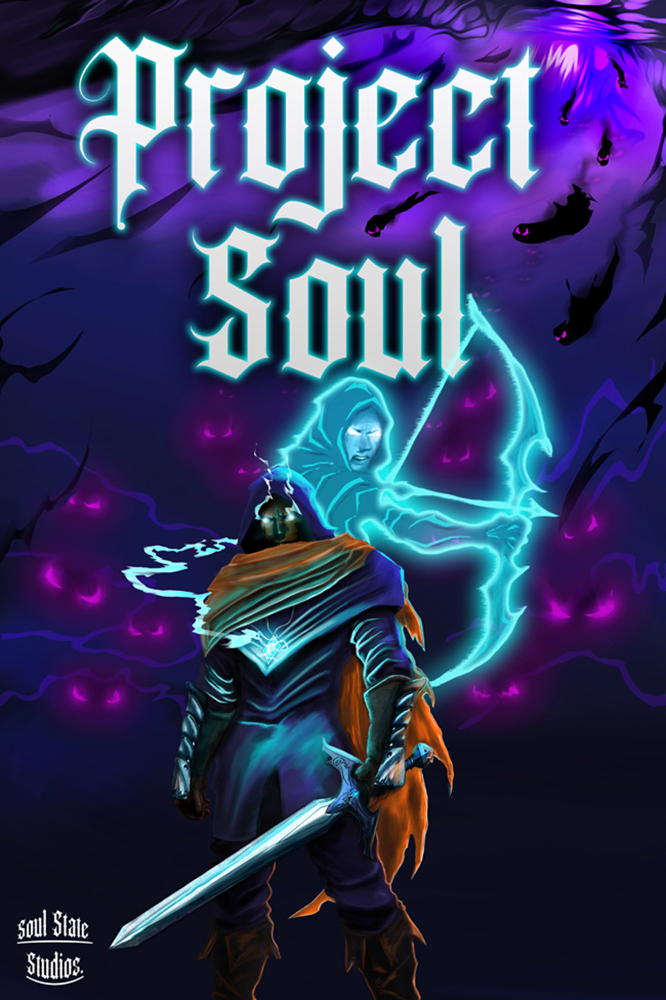
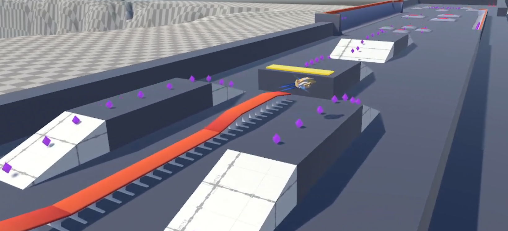
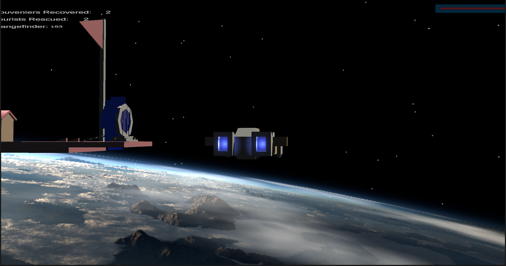
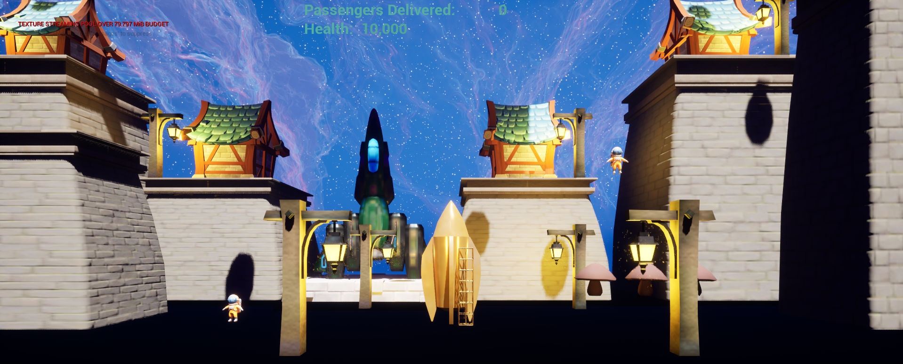
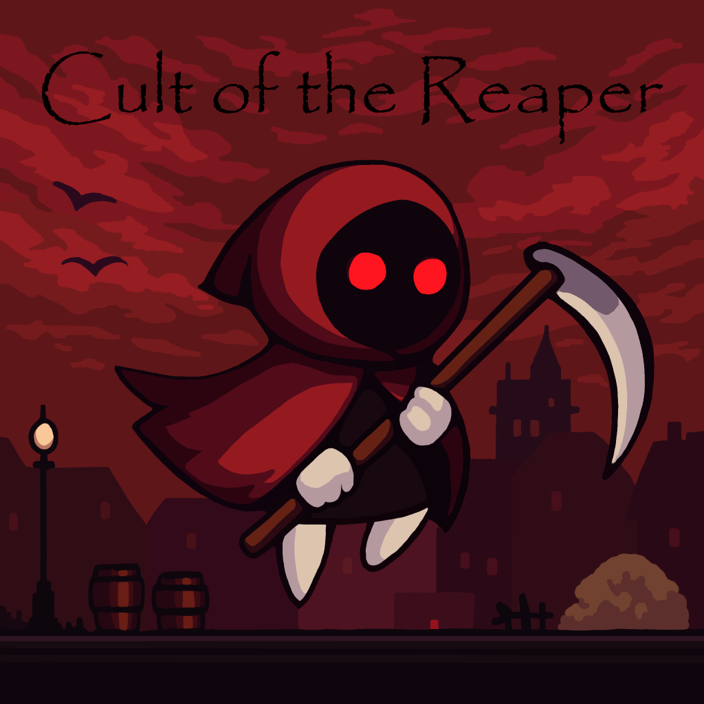
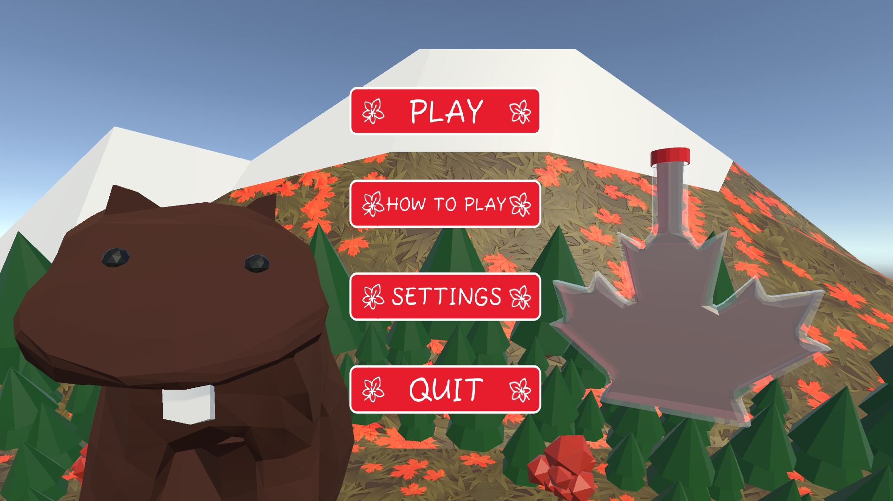

---
# Feel free to add content and custom Front Matter to this file.
# To modify the layout, see https://jekyllrb.com/docs/themes/#overriding-theme-defaults

layout: default
---

user styles - move to assets/css/style.scss when we move beyond a one page layout

Heading - About me

<a href="https://www.linkedin.com/in/jonathan-anthony-7a267a72/" target="_blank">Jonathan</a>

- Game Development Portfolio -

---

Demo Reel

- Demo Reel -

    <iframe src="https://player.vimeo.com/video/1096539283?badge=0&amp;autopause=0&amp;player_id=0&amp;app_id=58479" width="560" height="315" frameborder="0" allow="autoplay; fullscreen; picture-in-picture; clipboard-write; encrypted-media; web-share" referrerpolicy="strict-origin-when-cross-origin" title="Demo Reel - Game Developer"></iframe>

<!--
good colour but doesn't fit with the current theme without updating the yellow hyperlinks and white text, which we will do another day on another pass

-->

---

Capstone Project - Video Embed

- TFS Capstone Project -

<!-- - either this or the video embed seems to be enough, both show similar images -->

    <iframe width="560" height="315" src="https://www.youtube.com/embed/W3JXC9hvvfQ?si=IMtTX5IqPTELV5bM" title="YouTube video player" frameborder="0" allow="accelerometer; autoplay; clipboard-write; encrypted-media; gyroscope; picture-in-picture; web-share" referrerpolicy="strict-origin-when-cross-origin" allowfullscreen></iframe>

 Capstone Project - Synopsis 

<strong><a href="https://projectsoul2025.itch.io/project-soul" target="_blank">Project Soul</a></strong> 

  

  
  

      <strong>Toronto Film School Capstone Project</strong> - Winter 2025  
      A 2.5D side scrolling action platformer styled after the likes of Trine and Mandragora 
       

**Roles:**
- Assistant Producer
- Project management (Azure DevOps)
- Tools Engineer

**Contributions:**
- Dialogue and Quest system
- Scrums/Azure sprint and board management
- PR's, merge conflicts

Capstone Project - Technical Details

  

    <strong>Click here for technical details about Project Soul</strong>
    ▼
  

   

  **Language/Engine:**
  - C# / Unity

  **Contributed Features:**

  **Dialogue System**
  - Node-based dialogue editor using ScriptableObjects
  - Pre/post node triggers
    - For giving or completing quests, providing quest rewards
    - Expandable for other in-game events
  - Conditional dialogue
    - Supported multiple conditions with AND / OR

  **Quest System**
  - Utilized ScriptableObjects
  - Configurable number and type of quest objectives
  - Provided hooks for dialogue or other systems to verify quest status  
 
  **Project involvement**
  - Handling PR's, branching, versioning, releases
  - Azure DevOps roadmap, sprints, tickets, regular in-class scrums  
  - Implementing Quests as designed by the art lead

  **[TFS Release Announcement](https://projectsoul2025.itch.io/project-soul)** 
  

    

___

DSSP - Synopsis

- School Projects -

    <strong>
        <a href="https://sourceofentropy.itch.io/dssp" target="_blank">Deep Space Speeder Park</a>
    </strong> 

  

  A physics-based sci-fi vehicle sim set on an asteroid with a "skate park" for space speeders.

Deep Space Speeder Park - Technical Details

  

    <strong>Click here for technical details about Deep Space Speeder Park</strong>
    ▼
  

   

**Language/Engine:**
  - C# / Unity

  **Notable Features:**
  - Independent physics-based maneuvering thrusters, main engines, and brake thrusters
  - "Repulsor-like" suspension (similar to "Luke's land speeder") 
  - Particle physics-based "elevator"
  
  

    

SMGDT - Synopsis

    <strong>
        <a href="https://sourceofentropy.itch.io/smgdt-prototype-edition" target="_blank">Space Mini Golf Death Trench</a>
    </strong> 

  

  A physics-based arcade adventure atop weaponized space mini golf platforms. 

  War has returned and the Intergalactic Minigolf Consortium has deemed that all tourist destinations adjacent to Stargates be retrofit for combat. And it's your job to stop them.

Deep Space Speeder Park - Technical Details

  

    <strong>Click here for technical details about Space Mini Golf Death Trench</strong>
    ▼
  

   

**Language/Engine:**
  - C# / Unity

  **Notable Features:**
  - Physics based controller
  - Dotween Library for scripted obstacle movement
  
  

      

Rocket Ship Valet - Synopsis

    <strong>
        <a href="https://sourceofentropy.itch.io/rocket-ship-valet" target="_blank">Rocket Ship Valet</a>  
    </strong> 

  

  An unusual take on the standard lunar lander assignment 

  Collect and deliver passengers in the most unwieldy of spacecraft

Rocket Ship Valet - Expanded section - if any

  

    <strong>Click here for technical details about Rocket Ship Valet</strong>
    ▼
  

   

**Language/Engine:**
  - Blueprints / Unreal 5

  **Notable Features:**
  - Physics based
  - Pick up passengers via tractor beam or just crash into them the old fashioned way
  - Avoid miniature black holes and springy space mushrooms
  
  

      

___

Game Jams

- Game Jams -

Cult of the Reaper - Synopsis
<a href="https://sourceofentropy.itch.io/cult-of-the-reaper" target="_blank">Cult of the Reaper</a> - Summer 2025 TFS Game Jam Winner

Cult of the Reaper - Expanded section -if any

  

    <strong>Click here for technical details about Cult of the Reaper</strong>
    ▼
  

   

**Language/Engine:**
  - C# / Unity

  **Contributed Features:**
  - 2D Character controller, character abilitiy system
  - Base enemy AI (basic patrolling, etc)
  - Zones/Rooms
  - "Harvest" mechanic
    - Enemies with a glowing halo are marked for harvest
    - When you hide and a marked enemy crosses your path, the halo turns green indicating they are ripe for harvest
    - They remain 'ripe' for a configurable duration once they pass where you're hidden
    - Strike them while the halo is grain to gain 'Harvest'
    - Eventual plan is to use your harvest score to gate progression in certain areas of the game as it expands     

  

      

Fort Maple - Synopsis

<a href="https://theredpool.itch.io/fort-maple" target="_blank">Fort Maple</a>

April 2025 TFS Game Jam Winner  

What Canadian Beaver doesn't want to run their own Maple Syrup farm?  
Fort Maple was by a team of 3 programmers and 1 artist over the course of a 3.5 day game jam.  

Fort Maple - Expanded Section - if any

  

    <strong>Click here for technical details about Fort Maple</strong>
    ▼
  

   

**Language/Engine:**
  - C# / Unity

  **Contributed Features:**
  - Soundtrack and audio fx
  - Farmstand shop (cut due to scope)
   
  

      

___

Past projects

- Past Live Service / Backend Projects -

During my time at Cloudhead Games I worked as a Backend Engineer creating the backend platform for Pistol Whip and future titles.  

The mandate was to create a High Availability micro cloud product to accomodate current demands and expand for future growth and future games.

  

    <strong>Technical Details</strong>
    ▼
  

  
   

**Backend**

    - Python, Django, Mysql

**Platform**

    - Docker, Docker-compose  
    - Digital Ocean Kubernetes
    - Nginx
  

  

      

Pistol Whip - Video Embeds

Pistol Whip 2089
- A Blade Runner / Terminator inspired expansion for the award winning VR shooter Pistol Whip

<iframe width="560" height="315" src="https://www.youtube.com/embed/LZVEEWk9bzg?si=En8aQifi3EgMi3zZ" title="YouTube video player" frameborder="0" allow="accelerometer; autoplay; clipboard-write; encrypted-media; gyroscope; picture-in-picture; web-share" referrerpolicy="strict-origin-when-cross-origin" allowfullscreen></iframe>

Pistol Whip Styles  
- The Styles system was a major addition to Pistol Whips modifiers and leaderboards, allowing for potentially millions of modifier combinations each with their own custom leaderboards.
<iframe width="560" height="315" src="https://www.youtube.com/embed/6wu_bqQiHvg?si=1swwS-TGAfwuot3k" title="YouTube video player" frameborder="0" allow="accelerometer; autoplay; clipboard-write; encrypted-media; gyroscope; picture-in-picture; web-share" referrerpolicy="strict-origin-when-cross-origin" allowfullscreen></iframe>

Pistol Whip Smoke & Thunder  
- A Wild Wild West inspired expansion for the award winning VR shooter Pistol Whip
<iframe width="560" height="315" src="https://www.youtube.com/embed/3hhPAt0Nq94?si=RXqMzMvvdVzXXpcd" title="YouTube video player" frameborder="0" allow="accelerometer; autoplay; clipboard-write; encrypted-media; gyroscope; picture-in-picture; web-share" referrerpolicy="strict-origin-when-cross-origin" allowfullscreen></iframe>

  

___

Additional Courses

Bootcamps

- Bootcamps -

___

[Unity Bootcamp - University of Victoria - Continuing Studies](https://members.viatec.ca/event-calendar/Details/unity-in-interactive-storytelling-for-creative-technology-658646?sourceTypeId=Website)  
<!-- UVIC has removed the original course link -->

A 13 Week Unity Bootcamp instructed by [Charles Hache](https://www.linkedin.com/in/charles-hache/), a Unity Certified Instructor

**Features**
- First began Space Mini Golf Death Trench during this bootcamp
- Uses point lights, spot lights, emissive materials
- Dotween for scripted obstacle motion
- Object pooling for projectiles
- Mixed physics controller (main engines used physics)
- Particle FX
- Weapon system provided configuration of:
  - Shot rate, volley rate, volley size, number of weapon barrels

___

Udemy Courses

- Udemy Courses -

All courses listed are using Unity and C#

___

[Intro to Flight Physics](https://www.udemy.com/course/intro-to-airplane-physics-in-unity-3d/)  

**Features**
- Physics flight controller
- Highly configurable flight characteristics
  - Lift, Lift curve, Engine power band, roll rate, etc
- Animated control surfaces
  - Ailerons, Flaps, Rudder, Elevator, Propeller, Steerable wheels
- Save configurations to scriptable objects to quickly create persistant profiles for different styles/difficulties of flight or different aircraft performance
- Modular architecture allowing easy expansion for a viarety of aircraft configurations
  - ex. Multi-engine, wheel configuration

___

[The Beginners Guide to Games AI](https://www.udemy.com/course/artificial-intelligence-in-unity/ )  

**Features**
- A* navigation with waypoints
- NavMesh layers and masks
- Crowd behaviour, basic flocking
- GOAP, Behaviour Trees

___

#### Unity Dialogue & Quests: Intermediate 
- Course no longer available - was provided by GameDev.tv via Udemy

**Features**
- Node based dialogue editor with draggable nodes
- UI Layout groups
- Save quests and dialogue to scriptable objects
- Hooks for giving or completing quests, quest objectives, and quest rewards through dialogue or other in game events
- Ability to chain quest conditions with predicates (and/or/not)

___

[Learn to Create a Metroidvania Game](https://www.udemy.com/course/unity-metvania/)  

**Features**
- 2D Platformer w/2d animations, patrolling enemies, player abilities
- Multi-phase boss fight
- Multiple zones/scenes
- World Map
- Mini Map
- Game save/load

___

[Unity Mobile Game Development](https://www.udemy.com/course/unitymobilecourse/)  

**Features**
- Android build
- Touch controls
- Level Loader / Level Select Screen
- Boss sequence
- Unity Ads (Legacy)
  - Banner, Interstitial, Reward Ads
- Object pooling (of projectiles)

___

[Galaga 3D](https://www.udemy.com/course/unity-course-galaga-3d/)  

**Features**
- Waypoint system with bezier curves to produce smooth enemy paths
  - Includes editor gizmos for path visualization

___

[Pinball 3D](https://www.udemy.com/course/unity-game-tutorial-pinball-3d/)  

**Features**
- Editor tools provide a configurable mission editor
  - Ex. What targets to hit, how long you have to hit them, does the mission reset on player death, etc.
- Configurable lighting sequences, triggerable on mission completion
- Bumpers, Flippers, Targets, Plunger

___

[Ludo 3D](https://www.udemy.com/course/unity-game-tutorial-board-game-ludo-3d/)  

**Features**
- Clone of the Ludo board game
- Home base area, main routes, home routes
- Emulated physical dice
- Basic AI Players
- Bumping players
- Player select screen

___
