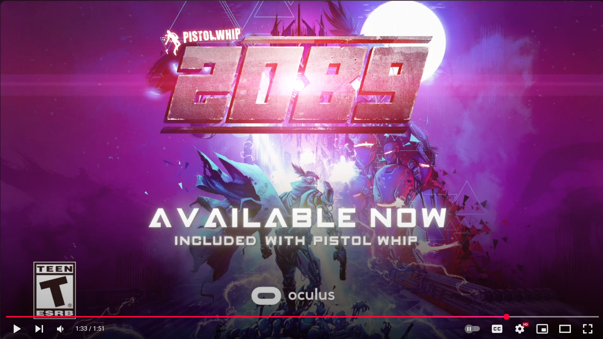
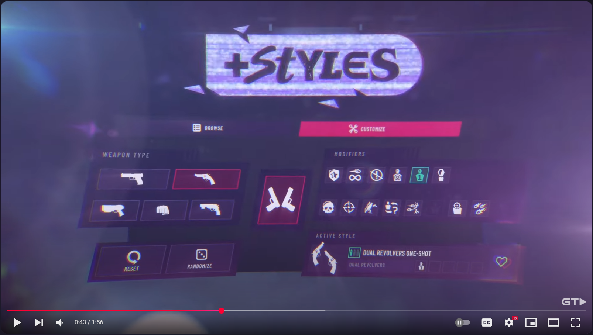
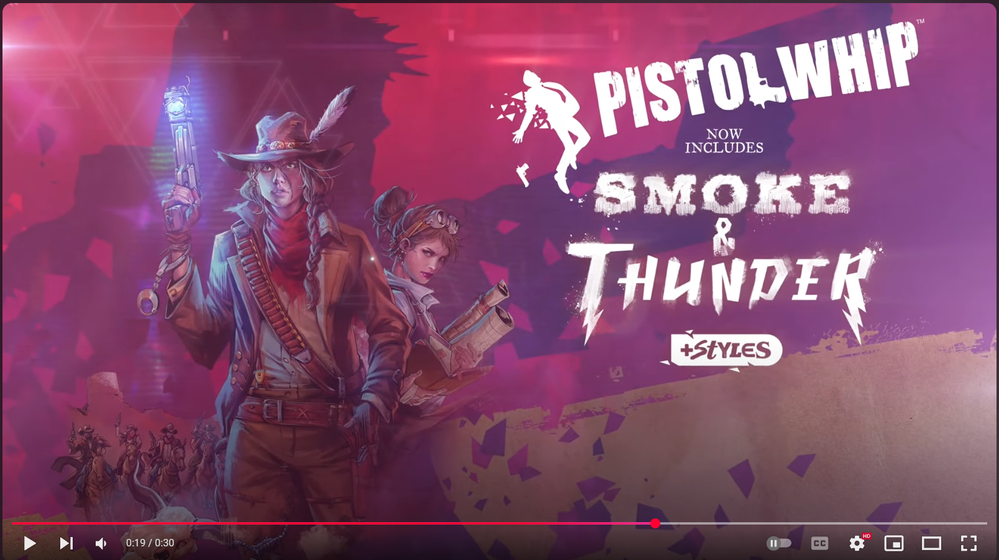

Shipped Game Expansions:  

Pistol Whip 2089

Launched a custom web backend for Pistol Whip that included integration with META's leaderboard system.  
System built with Python, Django and MySQL, running on DigitalOcean Kubernetes.  

Pistol Whip Style System

Pistol Whip Smoke and Thunder

School Projects:  

Deep Space Speeder Park - Coming Soon - 